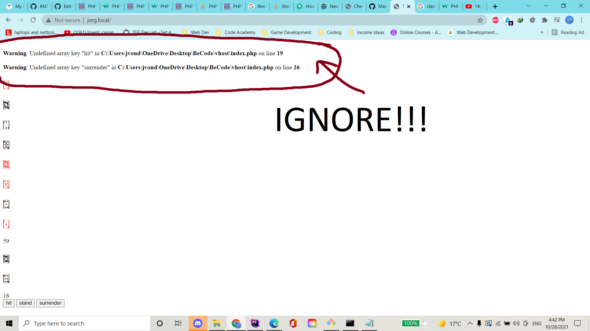

# oop-blackjackgame
> don't gamble folks.

## progress so far
* learned a ton about classes and object typing (thank you sicco!)
* created classes for the player and blackjack session
* created functions for each of the new classes
* created a class for the dealer as an extension of the player class
* modified the hit function for the dealer
* created a "view" file to display the game and interface

## //TODO
* fix logic for stand and surrender buttons
* create "end of the game" logic
* spruce the darn thing up
* implement first turn rule?
* implement betting system?

