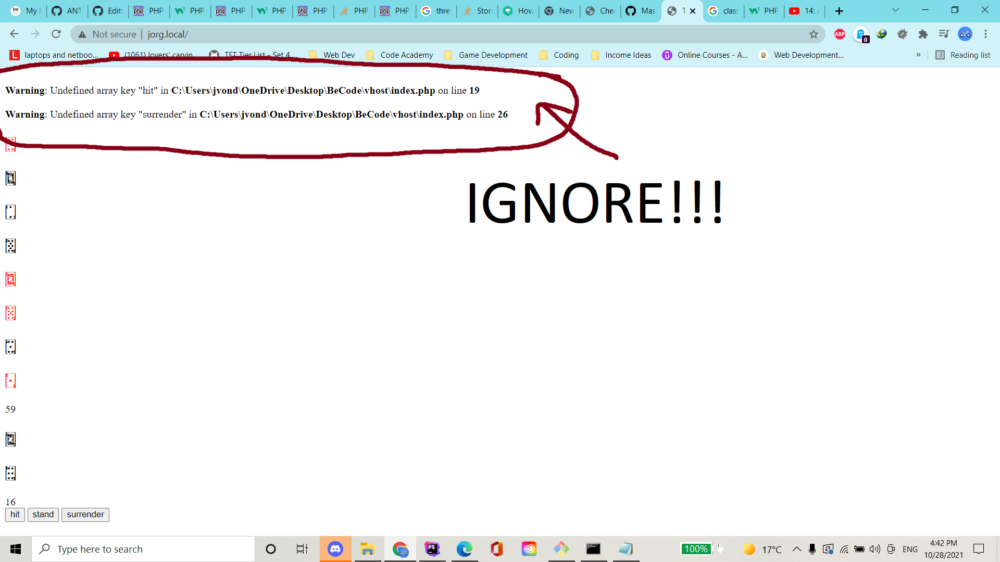
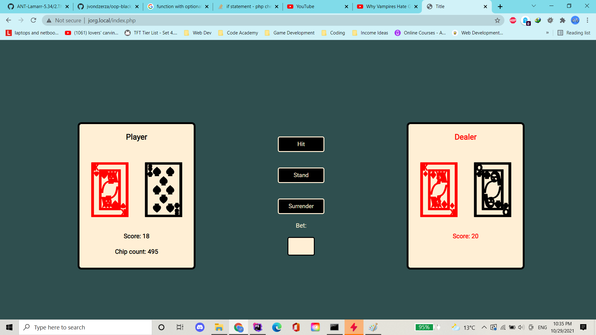

# oop-blackjackgame

> don't gamble folks.

## progress so far

* learned a ton about classes and object typing (thank you sicco!)
* created classes for the player and blackjack session
* created functions for each of the new classes
* created a class for the dealer as an extension of the player class
* modified the hit function for the dealer
* created a "view" file to display the game and interface
* fixed logic for stand and surrender buttons
* created "end of game" logic
* implemented a provisional betting system (still a lil' buggy)
* implemented logic for the first turn rule

## //TODO

* spruce the darn thing up some more

## from

## to
